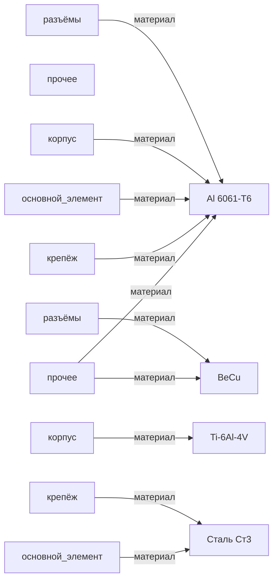

# Граф 1 — подсистема «встроенное_оружие»

```mermaid
graph LR
    izdelie_granatomet_m320[прочее]
    izdelie_minigun_m134[прочее]
    часть_granatomet_m320_mounting[крепёж]
    часть_granatomet_m320_core[основной_элемент]
    часть_granatomet_m320_housing[корпус]
    часть_granatomet_m320_connectors[разъёмы]
    часть_minigun_m134_connectors[разъёмы]
    часть_minigun_m134_housing[корпус]
    часть_minigun_m134_core[основной_элемент]
    часть_minigun_m134_mounting[крепёж]
    material_al_6061_t6[Al 6061-T6]
    material_becu[BeCu]
    material_stal_st3[Сталь Ст3]
    material_ti_6al_4v[Ti-6Al-4V]
    izdelie_granatomet_m320 -->|материал| material_al_6061_t6
    izdelie_granatomet_m320 -->|материал| material_becu
    часть_granatomet_m320_mounting -->|материал| material_al_6061_t6
    часть_granatomet_m320_core -->|материал| material_al_6061_t6
    часть_granatomet_m320_housing -->|материал| material_al_6061_t6
    часть_granatomet_m320_connectors -->|материал| material_becu
    часть_minigun_m134_connectors -->|материал| material_al_6061_t6
    часть_minigun_m134_housing -->|материал| material_ti_6al_4v
    часть_minigun_m134_core -->|материал| material_stal_st3
    часть_minigun_m134_mounting -->|материал| material_stal_st3
```

| Материал | Используется в частях |
|---|---:|
| `Al 6061-T6` | 5 |
| `BeCu` | 2 |
| `Сталь Ст3` | 2 |
| `Ti-6Al-4V` | 1 |
