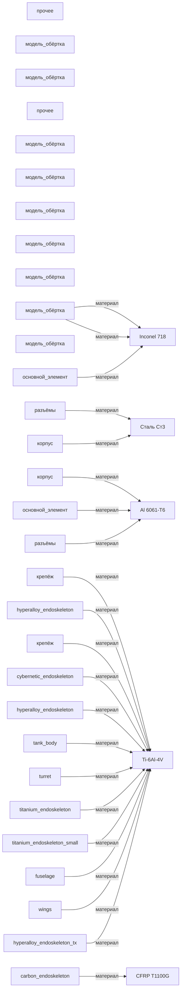

# Граф 1 — подсистема «каркас»

```mermaid
graph LR
    izdelie_kompensatory[прочее]
    izdelie_SkyNet_T850[модель_обёртка]
    izdelie_SkyNet_Rev9[модель_обёртка]
    izdelie_reshetchatyi_karkas[прочее]
    izdelie_SkyNet_MarcusWright[модель_обёртка]
    izdelie_SkyNet_T800[модель_обёртка]
    izdelie_SkyNet_HKTank[модель_обёртка]
    izdelie_SkyNet_T600[модель_обёртка]
    izdelie_SkyNet_Cameron[модель_обёртка]
    izdelie_SkyNet_HKAerial[модель_обёртка]
    izdelie_SkyNet_TX[модель_обёртка]
    часть_kompensatory_core[основной_элемент]
    часть_kompensatory_connectors[разъёмы]
    часть_kompensatory_housing[корпус]
    часть_kompensatory_mounting[крепёж]
    часть_t850_эндоскелет[hyperalloy_endoskeleton]
    часть_rev9_endoskeleton[carbon_endoskeleton]
    часть_reshetchatyi_karkas_mounting[крепёж]
    часть_reshetchatyi_karkas_housing[корпус]
    часть_reshetchatyi_karkas_core[основной_элемент]
    часть_reshetchatyi_karkas_connectors[разъёмы]
    часть_marcus_эндоскелет[cybernetic_endoskeleton]
    часть_t800_эндоскелет_торс[hyperalloy_endoskeleton]
    часть_hk_tank_корпус[tank_body]
    часть_hk_tank_башня[turret]
    часть_t600_эндоскелет[titanium_endoskeleton]
    часть_cameron_эндоскелет[titanium_endoskeleton_small]
    часть_hk_aerial_фюзеляж[fuselage]
    часть_hk_aerial_крылья[wings]
    часть_t_x_эндоскелет[hyperalloy_endoskeleton_tx]
    material_al_6061_t6[Al 6061-T6]
    material_cfrp_t1100g[CFRP T1100G]
    material_inconel_718[Inconel 718]
    material_stal_st3[Сталь Ст3]
    material_ti_6al_4v[Ti-6Al-4V]
    izdelie_SkyNet_HKAerial -->|материал| material_inconel_718
    izdelie_SkyNet_HKAerial -->|материал| material_inconel_718
    часть_kompensatory_core -->|материал| material_inconel_718
    часть_kompensatory_connectors -->|материал| material_stal_st3
    часть_kompensatory_housing -->|материал| material_al_6061_t6
    часть_kompensatory_mounting -->|материал| material_ti_6al_4v
    часть_t850_эндоскелет -->|материал| material_ti_6al_4v
    часть_rev9_endoskeleton -->|материал| material_cfrp_t1100g
    часть_reshetchatyi_karkas_mounting -->|материал| material_ti_6al_4v
    часть_reshetchatyi_karkas_housing -->|материал| material_stal_st3
    часть_reshetchatyi_karkas_core -->|материал| material_al_6061_t6
    часть_reshetchatyi_karkas_connectors -->|материал| material_al_6061_t6
    часть_marcus_эндоскелет -->|материал| material_ti_6al_4v
    часть_t800_эндоскелет_торс -->|материал| material_ti_6al_4v
    часть_hk_tank_корпус -->|материал| material_ti_6al_4v
    часть_hk_tank_башня -->|материал| material_ti_6al_4v
    часть_t600_эндоскелет -->|материал| material_ti_6al_4v
    часть_cameron_эндоскелет -->|материал| material_ti_6al_4v
    часть_hk_aerial_фюзеляж -->|материал| material_ti_6al_4v
    часть_hk_aerial_крылья -->|материал| material_ti_6al_4v
    часть_t_x_эндоскелет -->|материал| material_ti_6al_4v
```

| Материал | Используется в частях |
|---|---:|
| `Ti-6Al-4V` | 12 |
| `Inconel 718` | 3 |
| `Al 6061-T6` | 3 |
| `Сталь Ст3` | 2 |
| `CFRP T1100G` | 1 |
