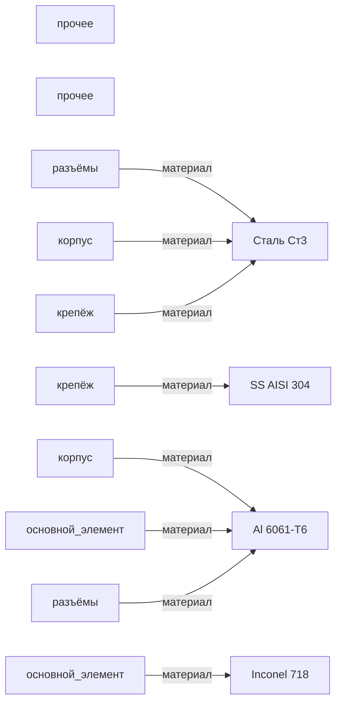

# Граф 1 — подсистема «каркас»

```mermaid
graph LR
    izdelie_kompensatory[прочее]
    izdelie_reshetchatyi_karkas[прочее]
    часть_kompensatory_connectors[разъёмы]
    часть_kompensatory_mounting[крепёж]
    часть_kompensatory_housing[корпус]
    часть_kompensatory_core[основной_элемент]
    часть_reshetchatyi_karkas_housing[корпус]
    часть_reshetchatyi_karkas_core[основной_элемент]
    часть_reshetchatyi_karkas_connectors[разъёмы]
    часть_reshetchatyi_karkas_mounting[крепёж]
    material_al_6061_t6[Al 6061-T6]
    material_inconel_718[Inconel 718]
    material_ss_aisi_304[SS AISI 304]
    material_stal_st3[Сталь Ст3]
    часть_kompensatory_connectors -->|материал| material_stal_st3
    часть_kompensatory_mounting -->|материал| material_ss_aisi_304
    часть_kompensatory_housing -->|материал| material_al_6061_t6
    часть_kompensatory_core -->|материал| material_inconel_718
    часть_reshetchatyi_karkas_housing -->|материал| material_stal_st3
    часть_reshetchatyi_karkas_core -->|материал| material_al_6061_t6
    часть_reshetchatyi_karkas_connectors -->|материал| material_al_6061_t6
    часть_reshetchatyi_karkas_mounting -->|материал| material_stal_st3
```

| Материал | Используется в частях |
|---|---:|
| `Сталь Ст3` | 3 |
| `Al 6061-T6` | 3 |
| `SS AISI 304` | 1 |
| `Inconel 718` | 1 |
