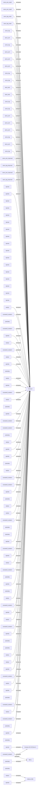

# Граф 1 — подсистема «приводная_система»

```mermaid
graph LR
    часть_cameron_рука_левая[servo_arm_small]
    часть_cameron_рука_правая[servo_arm_small]
    часть_cameron_нога_левая[servo_leg_small]
    часть_cameron_нога_правая[servo_leg_small]
    часть_marcus_нога_правая[servo_leg]
    часть_marcus_рука_правая[servo_arm]
    часть_marcus_нога_левая[servo_leg]
    часть_marcus_рука_левая[servo_arm]
    часть_t600_рука_правая[servo_arm]
    часть_t600_рука_левая[servo_arm]
    часть_t600_нога_правая[servo_leg]
    часть_t600_нога_левая[servo_leg]
    часть_hk_tank_гусеница_правая[tank_track]
    часть_hk_tank_гусеница_левая[tank_track]
    часть_t_x_нога_правая[servo_leg]
    часть_t_x_нога_левая[servo_leg]
    часть_t_x_рука_правая[servo_arm]
    часть_t_x_рука_левая[servo_arm]
    часть_t800_рука_левая[servo_arm]
    часть_t800_нога_левая[servo_leg]
    часть_t800_рука_правая[servo_arm]
    часть_t800_нога_правая[servo_leg]
    часть_t850_рука_правая[servo_arm_improved]
    часть_t850_нога_правая[servo_leg_improved]
    часть_t850_рука_левая[servo_arm_improved]
    часть_t850_нога_левая[servo_leg_improved]
    izdelie_bldc[прочее]
    izdelie_3d_pechatnye_dea[прочее]
    izdelie_povorotnoe_uplotnenie[прочее]
    izdelie_tcp[прочее]
    izdelie_apa[прочее]
    izdelie_elektroflyuidnye_volokna_mit[прочее]
    izdelie_gidravlicheskie_iskusstvennye_myshtsy_makkibbena[прочее]
    izdelie_tsa[прочее]
    izdelie_pezoelektricheskii_gromkogovoritel[прочее]
    izdelie_belleville_shaiby[прочее]
    izdelie_zubchataya_mufta[прочее]
    izdelie_dea[прочее]
    izdelie_ipmc[прочее]
    izdelie_opletku_iz_tokoprovodyaschih_izolirovannyh_provodov[прочее]
    izdelie_fleksury_8_diskov_po_0_15_mm[прочее]
    izdelie_bldc_+_enkoder[прочее]
    izdelie_hasel[прочее]
    часть_bldc_mounting[крепёж]
    часть_bldc_housing[корпус]
    часть_bldc_connectors[разъёмы]
    часть_bldc_core[основной_элемент]
    часть_3d_pechatnye_dea_housing[корпус]
    часть_3d_pechatnye_dea_mounting[крепёж]
    часть_3d_pechatnye_dea_core[основной_элемент]
    часть_3d_pechatnye_dea_connectors[разъёмы]
    часть_povorotnoe_uplotnenie_core[основной_элемент]
    часть_povorotnoe_uplotnenie_connectors[разъёмы]
    часть_povorotnoe_uplotnenie_mounting[крепёж]
    часть_povorotnoe_uplotnenie_housing[корпус]
    часть_tcp_core[основной_элемент]
    часть_tcp_housing[корпус]
    часть_tcp_connectors[разъёмы]
    часть_tcp_mounting[крепёж]
    часть_apa_housing[корпус]
    часть_apa_mounting[крепёж]
    часть_apa_connectors[разъёмы]
    часть_apa_core[основной_элемент]
    часть_elektroflyuidnye_volokna_mit_housing[корпус]
    часть_elektroflyuidnye_volokna_mit_mounting[крепёж]
    часть_elektroflyuidnye_volokna_mit_connectors[разъёмы]
    часть_elektroflyuidnye_volokna_mit_core[основной_элемент]
    часть_gidravlicheskie_iskusstvennye_myshtsy_makkibbena_core[основной_элемент]
    часть_gidravlicheskie_iskusstvennye_myshtsy_makkibbena_housing[корпус]
    часть_gidravlicheskie_iskusstvennye_myshtsy_makkibbena_mounting[крепёж]
    часть_gidravlicheskie_iskusstvennye_myshtsy_makkibbena_connectors[разъёмы]
    часть_tsa_mounting[крепёж]
    часть_tsa_housing[корпус]
    часть_tsa_core[основной_элемент]
    часть_tsa_connectors[разъёмы]
    часть_pezoelektricheskii_gromkogovoritel_connectors[разъёмы]
    часть_pezoelektricheskii_gromkogovoritel_core[основной_элемент]
    часть_pezoelektricheskii_gromkogovoritel_mounting[крепёж]
    часть_pezoelektricheskii_gromkogovoritel_housing[корпус]
    часть_belleville_shaiby_housing[корпус]
    часть_belleville_shaiby_core[основной_элемент]
    часть_belleville_shaiby_connectors[разъёмы]
    часть_belleville_shaiby_mounting[крепёж]
    часть_zubchataya_mufta_connectors[разъёмы]
    часть_zubchataya_mufta_core[основной_элемент]
    часть_zubchataya_mufta_mounting[крепёж]
    часть_zubchataya_mufta_housing[корпус]
    часть_dea_core[основной_элемент]
    часть_dea_mounting[крепёж]
    часть_dea_housing[корпус]
    часть_dea_connectors[разъёмы]
    часть_ipmc_connectors[разъёмы]
    часть_ipmc_core[основной_элемент]
    часть_ipmc_mounting[крепёж]
    часть_ipmc_housing[корпус]
    часть_opletku_iz_tokoprovodyaschih_izolirovannyh_provodov_core[основной_элемент]
    часть_opletku_iz_tokoprovodyaschih_izolirovannyh_provodov_mounting[крепёж]
    часть_opletku_iz_tokoprovodyaschih_izolirovannyh_provodov_housing[корпус]
    часть_opletku_iz_tokoprovodyaschih_izolirovannyh_provodov_connectors[разъёмы]
    часть_fleksury_8_diskov_po_0_15_mm_housing[корпус]
    часть_fleksury_8_diskov_po_0_15_mm_mounting[крепёж]
    часть_fleksury_8_diskov_po_0_15_mm_core[основной_элемент]
    часть_fleksury_8_diskov_po_0_15_mm_connectors[разъёмы]
    часть_bldc_+_enkoder_housing[корпус]
    часть_bldc_+_enkoder_connectors[разъёмы]
    часть_bldc_+_enkoder_mounting[крепёж]
    часть_bldc_+_enkoder_core[основной_элемент]
    часть_hasel_housing[корпус]
    часть_hasel_connectors[разъёмы]
    часть_hasel_core[основной_элемент]
    часть_hasel_mounting[крепёж]
    material_becu[BeCu]
    material_neilon_6_66[Нейлон 6/66]
    material_silikon_40_50_shore_a[Силикон 40–50 Shore A]
    material_ti_6al_4v[Ti-6Al-4V]
    часть_cameron_рука_левая -->|материал| material_ti_6al_4v
    часть_cameron_рука_правая -->|материал| material_ti_6al_4v
    часть_cameron_нога_левая -->|материал| material_ti_6al_4v
    часть_cameron_нога_правая -->|материал| material_ti_6al_4v
    часть_marcus_нога_правая -->|материал| material_ti_6al_4v
    часть_marcus_рука_правая -->|материал| material_ti_6al_4v
    часть_marcus_нога_левая -->|материал| material_ti_6al_4v
    часть_marcus_рука_левая -->|материал| material_ti_6al_4v
    часть_t600_рука_правая -->|материал| material_ti_6al_4v
    часть_t600_рука_левая -->|материал| material_ti_6al_4v
    часть_t600_нога_правая -->|материал| material_ti_6al_4v
    часть_t600_нога_левая -->|материал| material_ti_6al_4v
    часть_hk_tank_гусеница_правая -->|материал| material_ti_6al_4v
    часть_hk_tank_гусеница_левая -->|материал| material_ti_6al_4v
    часть_t_x_нога_правая -->|материал| material_ti_6al_4v
    часть_t_x_нога_левая -->|материал| material_ti_6al_4v
    часть_t_x_рука_правая -->|материал| material_ti_6al_4v
    часть_t_x_рука_левая -->|материал| material_ti_6al_4v
    часть_t800_рука_левая -->|материал| material_ti_6al_4v
    часть_t800_нога_левая -->|материал| material_ti_6al_4v
    часть_t800_рука_правая -->|материал| material_ti_6al_4v
    часть_t800_нога_правая -->|материал| material_ti_6al_4v
    часть_t850_рука_правая -->|материал| material_ti_6al_4v
    часть_t850_нога_правая -->|материал| material_ti_6al_4v
    часть_t850_рука_левая -->|материал| material_ti_6al_4v
    часть_t850_нога_левая -->|материал| material_ti_6al_4v
    izdelie_3d_pechatnye_dea -->|материал| material_silikon_40_50_shore_a
    izdelie_3d_pechatnye_dea -->|материал| material_becu
    часть_bldc_mounting -->|материал| material_ti_6al_4v
    часть_bldc_housing -->|материал| material_ti_6al_4v
    часть_bldc_core -->|материал| material_ti_6al_4v
    часть_3d_pechatnye_dea_housing -->|материал| material_neilon_6_66
    часть_3d_pechatnye_dea_mounting -->|материал| material_neilon_6_66
    часть_3d_pechatnye_dea_core -->|материал| material_silikon_40_50_shore_a
    часть_3d_pechatnye_dea_connectors -->|материал| material_becu
    часть_povorotnoe_uplotnenie_core -->|материал| material_ti_6al_4v
    часть_povorotnoe_uplotnenie_mounting -->|материал| material_ti_6al_4v
    часть_povorotnoe_uplotnenie_housing -->|материал| material_ti_6al_4v
    часть_tcp_core -->|материал| material_ti_6al_4v
    часть_tcp_housing -->|материал| material_ti_6al_4v
    часть_tcp_mounting -->|материал| material_ti_6al_4v
    часть_apa_housing -->|материал| material_ti_6al_4v
    часть_apa_mounting -->|материал| material_ti_6al_4v
    часть_apa_core -->|материал| material_ti_6al_4v
    часть_elektroflyuidnye_volokna_mit_housing -->|материал| material_ti_6al_4v
    часть_elektroflyuidnye_volokna_mit_mounting -->|материал| material_ti_6al_4v
    часть_elektroflyuidnye_volokna_mit_core -->|материал| material_ti_6al_4v
    часть_gidravlicheskie_iskusstvennye_myshtsy_makkibbena_core -->|материал| material_ti_6al_4v
    часть_gidravlicheskie_iskusstvennye_myshtsy_makkibbena_housing -->|материал| material_ti_6al_4v
    часть_gidravlicheskie_iskusstvennye_myshtsy_makkibbena_mounting -->|материал| material_ti_6al_4v
    часть_tsa_mounting -->|материал| material_ti_6al_4v
    часть_tsa_housing -->|материал| material_ti_6al_4v
    часть_tsa_core -->|материал| material_ti_6al_4v
    часть_pezoelektricheskii_gromkogovoritel_core -->|материал| material_ti_6al_4v
    часть_pezoelektricheskii_gromkogovoritel_mounting -->|материал| material_ti_6al_4v
    часть_pezoelektricheskii_gromkogovoritel_housing -->|материал| material_ti_6al_4v
    часть_belleville_shaiby_housing -->|материал| material_ti_6al_4v
    часть_belleville_shaiby_core -->|материал| material_ti_6al_4v
    часть_belleville_shaiby_mounting -->|материал| material_ti_6al_4v
    часть_zubchataya_mufta_core -->|материал| material_ti_6al_4v
    часть_zubchataya_mufta_mounting -->|материал| material_ti_6al_4v
    часть_zubchataya_mufta_housing -->|материал| material_ti_6al_4v
    часть_dea_core -->|материал| material_ti_6al_4v
    часть_dea_mounting -->|материал| material_ti_6al_4v
    часть_dea_housing -->|материал| material_ti_6al_4v
    часть_ipmc_core -->|материал| material_ti_6al_4v
    часть_ipmc_mounting -->|материал| material_ti_6al_4v
    часть_ipmc_housing -->|материал| material_ti_6al_4v
    часть_opletku_iz_tokoprovodyaschih_izolirovannyh_provodov_core -->|материал| material_ti_6al_4v
    часть_opletku_iz_tokoprovodyaschih_izolirovannyh_provodov_mounting -->|материал| material_ti_6al_4v
    часть_opletku_iz_tokoprovodyaschih_izolirovannyh_provodov_housing -->|материал| material_ti_6al_4v
    часть_fleksury_8_diskov_po_0_15_mm_housing -->|материал| material_ti_6al_4v
    часть_fleksury_8_diskov_po_0_15_mm_mounting -->|материал| material_ti_6al_4v
    часть_fleksury_8_diskov_po_0_15_mm_core -->|материал| material_ti_6al_4v
    часть_bldc_+_enkoder_housing -->|материал| material_ti_6al_4v
    часть_bldc_+_enkoder_mounting -->|материал| material_ti_6al_4v
    часть_bldc_+_enkoder_core -->|материал| material_ti_6al_4v
    часть_hasel_housing -->|материал| material_ti_6al_4v
    часть_hasel_core -->|материал| material_ti_6al_4v
    часть_hasel_mounting -->|материал| material_ti_6al_4v
```

| Материал | Используется в частях |
|---|---:|
| `Ti-6Al-4V` | 74 |
| `Силикон 40–50 Shore A` | 2 |
| `BeCu` | 2 |
| `Нейлон 6/66` | 2 |
