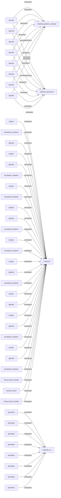

# Граф 1 — подсистема «прочее»

```mermaid
graph LR
    izdelie_dielektricheskie_elastomernye_datchiki[прочее]
    izdelie_provodnikovaya_nanoreshetka[прочее]
    izdelie_gibkii_pcb[прочее]
    izdelie_elastomernyh_dempferah[прочее]
    izdelie_gidrostaticheskie_gazovye_podshipniki_na_gelii[прочее]
    izdelie_slm_eos_m290[прочее]
    izdelie_polyimide_fpc[прочее]
    izdelie_copv[прочее]
    часть_dielektricheskie_elastomernye_datchiki_housing[корпус]
    часть_dielektricheskie_elastomernye_datchiki_connectors[разъёмы]
    часть_dielektricheskie_elastomernye_datchiki_core[основной_элемент]
    часть_dielektricheskie_elastomernye_datchiki_mounting[крепёж]
    часть_provodnikovaya_nanoreshetka_connectors[разъёмы]
    часть_provodnikovaya_nanoreshetka_housing[корпус]
    часть_provodnikovaya_nanoreshetka_mounting[крепёж]
    часть_provodnikovaya_nanoreshetka_core[основной_элемент]
    часть_gibkii_pcb_housing[корпус]
    часть_gibkii_pcb_core[основной_элемент]
    часть_gibkii_pcb_mounting[крепёж]
    часть_gibkii_pcb_connectors[разъёмы]
    часть_elastomernyh_dempferah_mounting[крепёж]
    часть_elastomernyh_dempferah_connectors[разъёмы]
    часть_elastomernyh_dempferah_core[основной_элемент]
    часть_elastomernyh_dempferah_housing[корпус]
    часть_gidrostaticheskie_gazovye_podshipniki_na_gelii_core[основной_элемент]
    часть_gidrostaticheskie_gazovye_podshipniki_na_gelii_housing[корпус]
    часть_gidrostaticheskie_gazovye_podshipniki_na_gelii_connectors[разъёмы]
    часть_gidrostaticheskie_gazovye_podshipniki_na_gelii_mounting[крепёж]
    часть_slm_eos_m290_core[основной_элемент]
    часть_slm_eos_m290_connectors[разъёмы]
    часть_slm_eos_m290_housing[корпус]
    часть_slm_eos_m290_mounting[крепёж]
    часть_polyimide_fpc_connectors[разъёмы]
    часть_polyimide_fpc_housing[корпус]
    часть_polyimide_fpc_mounting[крепёж]
    часть_polyimide_fpc_core[основной_элемент]
    часть_copv_connectors[разъёмы]
    часть_copv_housing[корпус]
    часть_copv_mounting[крепёж]
    часть_copv_core[основной_элемент]
    часть_cameron_ткань_кожа[living_tissue_female]
    часть_marcus_человеческая_кожа[human_tissue]
    часть_t_x_ткань_кожа[living_tissue_female]
    material_ti_6al_4v[Ti-6Al-4V]
    izdelie_dielektricheskie_elastomernye_datchiki -->|материал| material_generic_material
    izdelie_dielektricheskie_elastomernye_datchiki -->|материал| material_aluminum
    izdelie_provodnikovaya_nanoreshetka -->|материал| material_generic_material
    izdelie_provodnikovaya_nanoreshetka -->|материал| material_aluminum
    izdelie_gibkii_pcb -->|материал| material_generic_material
    izdelie_gibkii_pcb -->|материал| material_aluminum
    izdelie_elastomernyh_dempferah -->|материал| material_generic_material
    izdelie_elastomernyh_dempferah -->|материал| material_aluminum
    izdelie_gidrostaticheskie_gazovye_podshipniki_na_gelii -->|материал| material_generic_material
    izdelie_gidrostaticheskie_gazovye_podshipniki_na_gelii -->|материал| material_aluminum
    izdelie_slm_eos_m290 -->|материал| material_generic_material
    izdelie_slm_eos_m290 -->|материал| material_aluminum
    izdelie_polyimide_fpc -->|материал| material_generic_material
    izdelie_polyimide_fpc -->|материал| material_aluminum
    izdelie_copv -->|материал| material_generic_material
    izdelie_copv -->|материал| material_aluminum
    часть_dielektricheskie_elastomernye_datchiki_housing -->|материал| material_ti_6al_4v
    часть_dielektricheskie_elastomernye_datchiki_connectors -->|материал| material_cu
    часть_dielektricheskie_elastomernye_datchiki_core -->|материал| material_ti_6al_4v
    часть_dielektricheskie_elastomernye_datchiki_mounting -->|материал| material_ti_6al_4v
    часть_provodnikovaya_nanoreshetka_connectors -->|материал| material_cu
    часть_provodnikovaya_nanoreshetka_housing -->|материал| material_ti_6al_4v
    часть_provodnikovaya_nanoreshetka_mounting -->|материал| material_ti_6al_4v
    часть_provodnikovaya_nanoreshetka_core -->|материал| material_ti_6al_4v
    часть_gibkii_pcb_housing -->|материал| material_ti_6al_4v
    часть_gibkii_pcb_core -->|материал| material_ti_6al_4v
    часть_gibkii_pcb_mounting -->|материал| material_ti_6al_4v
    часть_gibkii_pcb_connectors -->|материал| material_cu
    часть_elastomernyh_dempferah_mounting -->|материал| material_ti_6al_4v
    часть_elastomernyh_dempferah_connectors -->|материал| material_cu
    часть_elastomernyh_dempferah_core -->|материал| material_ti_6al_4v
    часть_elastomernyh_dempferah_housing -->|материал| material_ti_6al_4v
    часть_gidrostaticheskie_gazovye_podshipniki_na_gelii_core -->|материал| material_ti_6al_4v
    часть_gidrostaticheskie_gazovye_podshipniki_na_gelii_housing -->|материал| material_ti_6al_4v
    часть_gidrostaticheskie_gazovye_podshipniki_na_gelii_connectors -->|материал| material_cu
    часть_gidrostaticheskie_gazovye_podshipniki_na_gelii_mounting -->|материал| material_ti_6al_4v
    часть_slm_eos_m290_core -->|материал| material_ti_6al_4v
    часть_slm_eos_m290_connectors -->|материал| material_cu
    часть_slm_eos_m290_housing -->|материал| material_ti_6al_4v
    часть_slm_eos_m290_mounting -->|материал| material_ti_6al_4v
    часть_polyimide_fpc_connectors -->|материал| material_cu
    часть_polyimide_fpc_housing -->|материал| material_ti_6al_4v
    часть_polyimide_fpc_mounting -->|материал| material_ti_6al_4v
    часть_polyimide_fpc_core -->|материал| material_ti_6al_4v
    часть_copv_connectors -->|материал| material_cu
    часть_copv_housing -->|материал| material_ti_6al_4v
    часть_copv_mounting -->|материал| material_ti_6al_4v
    часть_copv_core -->|материал| material_ti_6al_4v
    часть_cameron_ткань_кожа -->|материал| material_ti_6al_4v
    часть_marcus_человеческая_кожа -->|материал| material_ti_6al_4v
    часть_t_x_ткань_кожа -->|материал| material_ti_6al_4v
```

| Материал | Используется в частях |
|---|---:|
| `Ti-6Al-4V` | 27 |
| `material_generic_material` | 8 |
| `material_aluminum` | 8 |
| `material_cu` | 8 |
