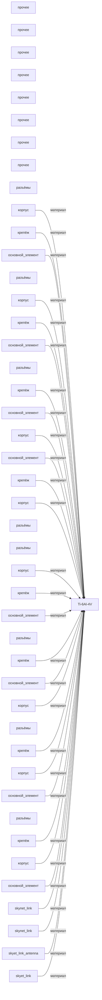

# Граф 1 — подсистема «система_связи»

```mermaid
graph LR
    izdelie_radiatsionno_stoikii_neiromorfnyi_tmr[прочее]
    izdelie_flat_face_couplings_iso_16028[прочее]
    izdelie_stm32h743[прочее]
    izdelie_stm32[прочее]
    izdelie_razryvnye_mufty_iso_16028[прочее]
    izdelie_usb_c[прочее]
    izdelie_optovolokonnaya_shina[прочее]
    izdelie_obd_ii[прочее]
    часть_radiatsionno_stoikii_neiromorfnyi_tmr_connectors[разъёмы]
    часть_radiatsionno_stoikii_neiromorfnyi_tmr_housing[корпус]
    часть_radiatsionno_stoikii_neiromorfnyi_tmr_mounting[крепёж]
    часть_radiatsionno_stoikii_neiromorfnyi_tmr_core[основной_элемент]
    часть_flat_face_couplings_iso_16028_connectors[разъёмы]
    часть_flat_face_couplings_iso_16028_housing[корпус]
    часть_flat_face_couplings_iso_16028_mounting[крепёж]
    часть_flat_face_couplings_iso_16028_core[основной_элемент]
    часть_stm32h743_connectors[разъёмы]
    часть_stm32h743_mounting[крепёж]
    часть_stm32h743_core[основной_элемент]
    часть_stm32h743_housing[корпус]
    часть_stm32_core[основной_элемент]
    часть_stm32_mounting[крепёж]
    часть_stm32_housing[корпус]
    часть_stm32_connectors[разъёмы]
    часть_razryvnye_mufty_iso_16028_connectors[разъёмы]
    часть_razryvnye_mufty_iso_16028_housing[корпус]
    часть_razryvnye_mufty_iso_16028_mounting[крепёж]
    часть_razryvnye_mufty_iso_16028_core[основной_элемент]
    часть_usb_c_connectors[разъёмы]
    часть_usb_c_mounting[крепёж]
    часть_usb_c_core[основной_элемент]
    часть_usb_c_housing[корпус]
    часть_optovolokonnaya_shina_connectors[разъёмы]
    часть_optovolokonnaya_shina_mounting[крепёж]
    часть_optovolokonnaya_shina_housing[корпус]
    часть_optovolokonnaya_shina_core[основной_элемент]
    часть_obd_ii_connectors[разъёмы]
    часть_obd_ii_mounting[крепёж]
    часть_obd_ii_housing[корпус]
    часть_obd_ii_core[основной_элемент]
    часть_hk_aerial_связь[skynet_link]
    часть_hk_tank_связь[skynet_link]
    часть_t800_антенна[skyet_link_antenna]
    часть_t850_связь[skyet_link]
    material_ti_6al_4v[Ti-6Al-4V]
    часть_radiatsionno_stoikii_neiromorfnyi_tmr_housing -->|материал| material_ti_6al_4v
    часть_radiatsionno_stoikii_neiromorfnyi_tmr_mounting -->|материал| material_ti_6al_4v
    часть_radiatsionno_stoikii_neiromorfnyi_tmr_core -->|материал| material_ti_6al_4v
    часть_flat_face_couplings_iso_16028_housing -->|материал| material_ti_6al_4v
    часть_flat_face_couplings_iso_16028_mounting -->|материал| material_ti_6al_4v
    часть_flat_face_couplings_iso_16028_core -->|материал| material_ti_6al_4v
    часть_stm32h743_mounting -->|материал| material_ti_6al_4v
    часть_stm32h743_core -->|материал| material_ti_6al_4v
    часть_stm32h743_housing -->|материал| material_ti_6al_4v
    часть_stm32_core -->|материал| material_ti_6al_4v
    часть_stm32_mounting -->|материал| material_ti_6al_4v
    часть_stm32_housing -->|материал| material_ti_6al_4v
    часть_razryvnye_mufty_iso_16028_housing -->|материал| material_ti_6al_4v
    часть_razryvnye_mufty_iso_16028_mounting -->|материал| material_ti_6al_4v
    часть_razryvnye_mufty_iso_16028_core -->|материал| material_ti_6al_4v
    часть_usb_c_mounting -->|материал| material_ti_6al_4v
    часть_usb_c_core -->|материал| material_ti_6al_4v
    часть_usb_c_housing -->|материал| material_ti_6al_4v
    часть_optovolokonnaya_shina_mounting -->|материал| material_ti_6al_4v
    часть_optovolokonnaya_shina_housing -->|материал| material_ti_6al_4v
    часть_optovolokonnaya_shina_core -->|материал| material_ti_6al_4v
    часть_obd_ii_mounting -->|материал| material_ti_6al_4v
    часть_obd_ii_housing -->|материал| material_ti_6al_4v
    часть_obd_ii_core -->|материал| material_ti_6al_4v
    часть_hk_aerial_связь -->|материал| material_ti_6al_4v
    часть_hk_tank_связь -->|материал| material_ti_6al_4v
    часть_t800_антенна -->|материал| material_ti_6al_4v
    часть_t850_связь -->|материал| material_ti_6al_4v
```

| Материал | Используется в частях |
|---|---:|
| `Ti-6Al-4V` | 28 |
